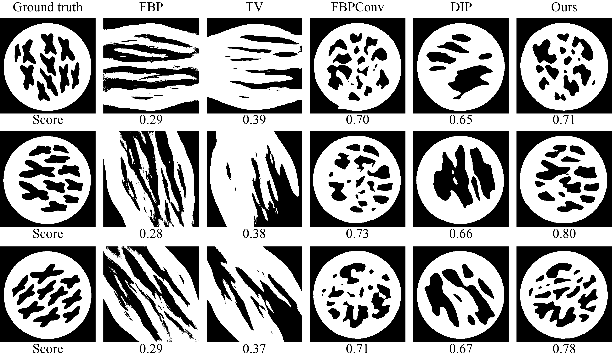

Repository for the paper "**HD-DCDM: Hybrid-domain Network for Limited-Angle Computed Tomography with Deconvolution and Conditional Diffusion Model**"

## The limited-angle CT challenge  
The [Helsinki Tomography Challenge 2022(HTC 2022)](https://www.fips.fi/HTC2022.php) is about limited-angle computational tomography. The main challenge of this image reconstruction problem are as follows

- Due to the extremely limited probing degree, the obtained real-life data inevitably miss the information of the wavefront set of the singular support of the obstacle. This part of theory is completed by Todd Quinto using microlocal analysis since the late 1980s. It shows the incapability of Back-projection method, even if the measurement is dealt with carefully.
- Due to the ill-posedness induced by the loss of information, measurement error is amplified tremendously in the inversion process, thus suitable regularization technique should be taken. 

## Algorithm Introduction
Concerning the above challenges, we propose an algorithm which is a combination of back-projection(BP) method and image deblurring network. To meet the requirements of the competition, the proposed algorithm consists of the following steps:
- **BP**: The measured limited-angle sinogram is first processed by the BP method. In this part, the implement of the BP method is based on astra package.
- **Deblur**: The reconstruction of the BP method is then passed to a deblurring network to recover the details of the phantom. The code of this network is based on *[Deep Residual Fourier Transformation for Single Image Deblurring](https://github.com/INVOKERer/DeepRFT)*. We modify and train the network to improve the quality of the reconstruction.
- **Super resolution**: Since the competition requires that the output figure should have size 512 $\times$ 512, and the deblurring network is hard to train with this size, we use the super resolution technology to meet the requirements. This network is based on *[Residual Dense Network for Image Super-Resolution](https://github.com/yulunzhang/RDN)*.
- **Threshold**: The result is obtained by applying a threshold to the high-resolution image.    


## Installation instructions        
The code uses the following packages:

```
argparse
astra
math
numpy
os
pylab
scipy
skimage
torch
```

To install these packages, run:

```
cd ./installation
conda env create -f Torch.yaml
```

## Usage instructions

The pre-trained weights of the networks and part of the training data of HTC 2022 are provided in this repository. To test the algorithm, just run the following code

```
python main.py --data_dir './data/' --out_dir './output/' --group_number 1
```

`--data_dir` : Folder where the input files are located.

`--out_dir` : Folder where the output files is stored.

`--group_number` : Group category number.

## Examples

We list the results of `htc2022_ta_full` here as an example. The test data whose projection angle is limited to [0,90] is provided in the data folder as an example. The result can be easily obtained by running

```
python main.py
```

**Results （angle views = 30°）**:




